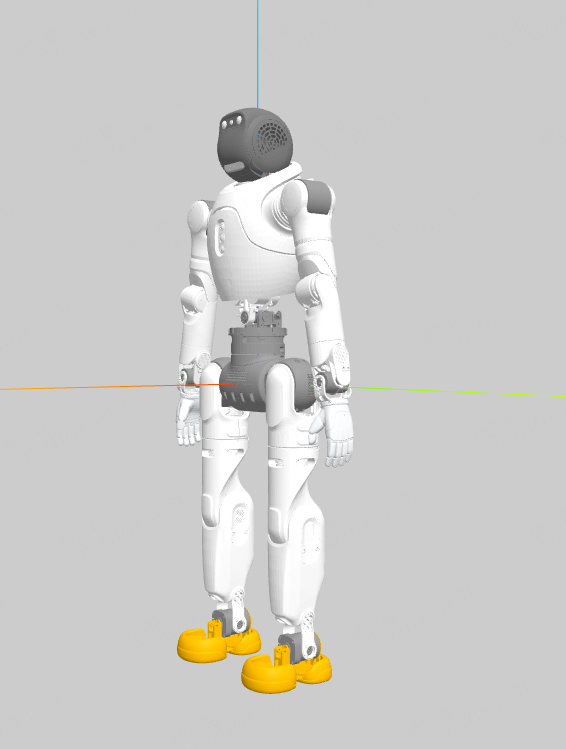
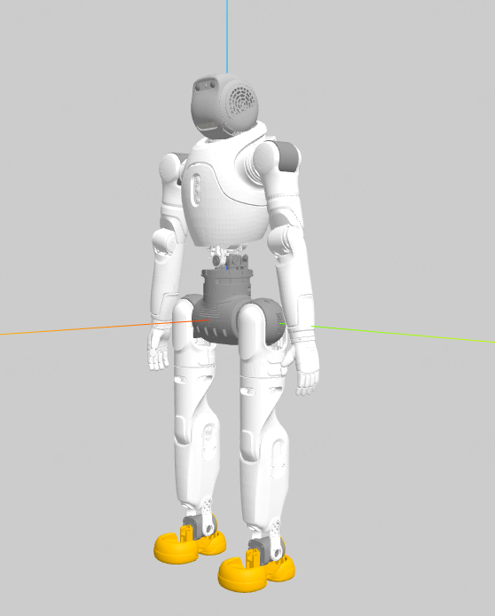
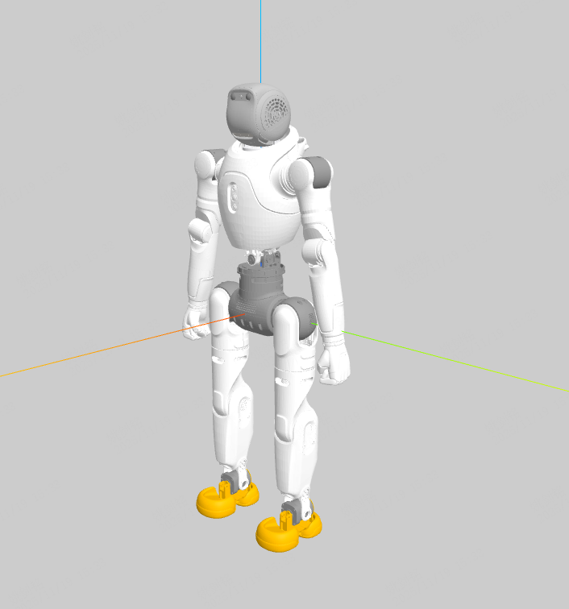

# FF Master Model Assets

## Debug Tools

### XML and URDF

```bash
python -m mujoco.viewer
```

Install MuJoCo:

```bash
pip install mujoco
```

### URDF

VS Code extension: **URDF Visualizer**

## Variants

### ff_master_ultra (plus)



### ff_master_hand (plus)



### ff_master_fist (plus)


