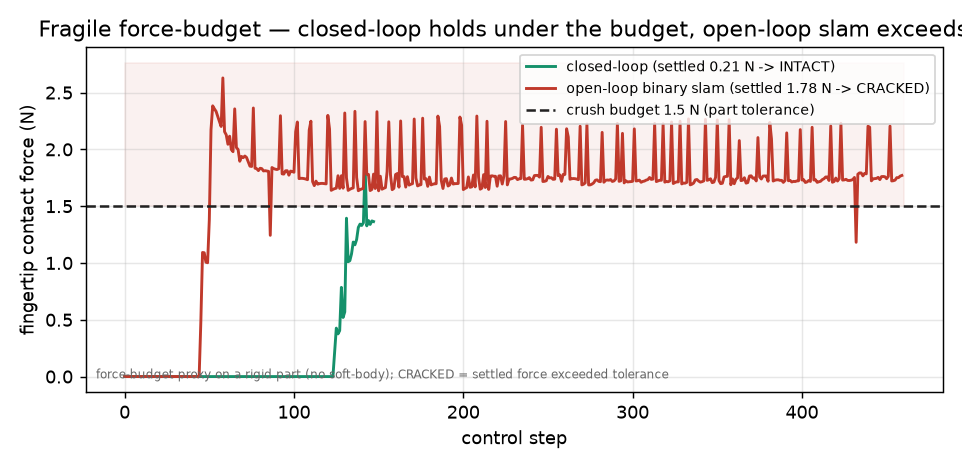
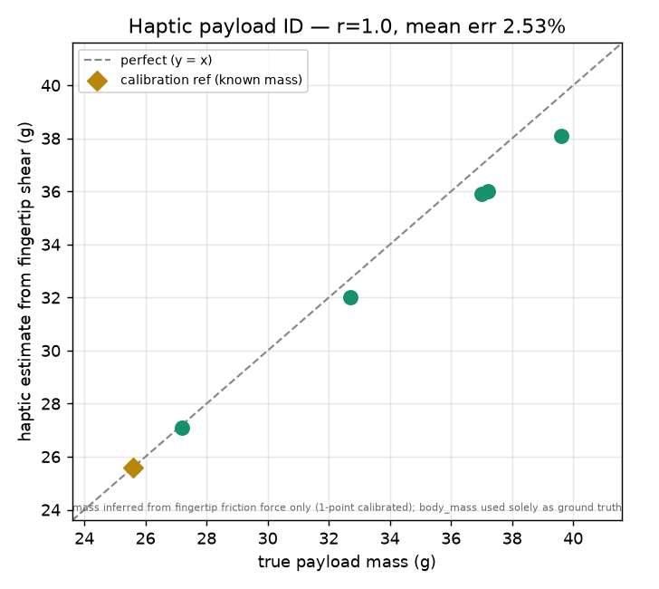

# PandaPick

**A Franka Panda that closes the loop on contact force: it reads fingertip force from the simulation
and regulates every grasp to a calibrated setpoint — instead of a blind binary slam — so it can pick a
**fragile part without crushing it**, run pick-place and colour-sorting jobs across randomized scenes,
and log every (observation, action, grip-force) step as a ready-made imitation-learning dataset.**

**True closed-loop integration:** every capability also runs as ONE continuous 6-phase sequence —
_approach → force-regulated grasp → lift → hold against an external disturbance → precision place →
verify_ — scored as a single composite (**100 / 100**), not six disconnected demos.

Runs on MuJoCo, CPU-only, in one command.


_Above: the live demo (`results/pandapick_demo.mp4` + `results/pandapick_narration.srt`, produced by
`python run.py --demo`, ~65 s). A **live grip-force HUD** shows the closed loop settling each grasp into
the target band; the hero shot is a same-seed **crush-vs-save**: the closed loop holds a fragile part
INTACT under its force budget while the open-loop binary slam exceeds it (**CRACKED**). A
`ctrl-only / no qpos teleport` badge marks the real physics; every step is logged._

---

## What's new: a real closed loop, with stakes

Most arm demos drive the gripper open-loop — a fixed "close" command, no idea how hard it is gripping.
PandaPick instead **reads `mj_contactForce` at the fingertips every step and P-regulates the gripper to
a measured target force**. That single change is the difference between a scripted animation and a
controller — and it has a **consequence you can see**:

- **Picks a fragile part without crushing it.** Against a part rated to a **1.5 N sustained-crush budget**,
  the closed loop holds every part **INTACT** (settled grip **0.98–1.28 N**, mean **1.15 N**, **6/6**),
  while the blind open-loop binary slam sustains **1.78–1.87 N → over budget → CRACKED on all 6**. Same
  seeds, same scene, same code path — only the loop changes. (`results/fragile.json`, `fragile_plot.png`.)
- **Closed-loop grasp force regulated to 1.3 N** (RMSE 0.41 N) vs an open-loop binary slam at **1.84 N
  → 29 % gentler**, measured on identical seeds (`results/ablation.json`).
- **The same force sense also _weighs_ the object.** Holding a part statically, the fingertip **shear
  (friction) force balances gravity and is linear in mass** — so the gripper reads the payload's weight.
  Calibrate the gain once against a known reference (like a load cell), then estimate unseen 25–40 g
  payloads from force alone: **Pearson r = 1.0, mean error 2.53 % (max 3.8 %)** — never from `qpos`.
  (`results/payload.json`, `payload_plot.png`.) One fingertip force channel, two jobs: don't-crush **and**
  payload identification.
- **It genuinely uses the sensor:** blind the force read and the converged grip changes (1.36 N → 1.74 N).
  A cosmetic loop would not move. `python run.py --audit` proves it.
- **Real physics:** the loop writes `d.ctrl` **only — never `qpos`**. Cubes are freejoint bodies; nothing
  teleports or is welded into place.

> **Honest scope of "CRACKED":** this is a **force-budget proxy on a rigid part** (no soft-body). CRACKED
> means the **sustained** grip force exceeded the stated tolerance — the cube does not physically deform
> or shatter. The verdict is gated on the **settled** (tail-mean) force, never the transient first-contact
> peak. CRACKED runs are an **ablation metric, never counted as a task failure.**

## What it does

Two job types over randomized scenes, plus a fragile-grasp class:

- **Pick & place** — grasp each cube (to a regulated force) off its feeder post and place it in the tote.
- **Colour sort** — read each cube's colour and route it to the matching R / G / B bin.
- **Fragile (gentle-carry)** — grasp and carry at the regulated force the whole way (no firm-up), so the
  part stays under its crush budget from pickup to placement.

Each job is a state machine (approach → descend → **force-regulated grasp** → lift → transport → place →
release → retract), and every control step — including the measured grip force — is recorded.

## Results at a glance

A **17-task benchmark** (pick-place, colour-sort, multi-object 2–4 cubes, and fragile gentle-carry jobs,
randomized positions/colours per seed) — every number is measured from the MuJoCo rollout, nothing
hand-written:

- **17 / 17 tasks solved, 100 %** task success rate
- **fragile force budget (1.5 N): closed-loop keeps 6/6 parts INTACT (settled 1.15 N), open-loop binary
  slam CRACKS 6/6 (settled 1.83 N > budget)** — same seeds, the closed loop is the only difference
- **true closed-loop integration: 6-phase composite 100 / 100** — approach → force-grasp → lift → hold-under-disturbance → place → verify, as ONE continuous run
- **haptic payload identification: object mass read from fingertip shear force, Pearson r = 1.0, mean error
  2.53 %** (1-point calibration, 25–40 g payloads) — the same force sense that avoids crushing also weighs the part
- **closed-loop grasp force: regulated to 1.3 N during approach/settle** (RMSE 0.41 N) — **29 % gentler**
  than the 1.84 N open-loop binary slam; the carry then **firms to a secure hold** for the standard jobs,
  while the **fragile** job keeps the gentle grip the whole way
- **secured-grasp stability: holds a 5 N disturbance ≈ 19.9× the object's weight** (measured at the firm
  carry grip) without dropping
- placement precision: **13.3 mm** mean
- control: **closed-loop contact-force-regulated grasp** (approach/settle) layered on **resolved-rate (Jacobian) IK**
- demonstrations logged: **144,230** state-action steps (with a `grip_force_N` column) → imitation dataset
- full run: a few seconds per task on a laptop **CPU, no GPU**

### Measured contrast — closed-loop vs open-loop (identical seeds)

| Grasp                       | Settled grip force     | Fragile part (1.5 N budget) | Tracks a setpoint?   | Sensor needed?          |
| --------------------------- | ---------------------- | --------------------------- | -------------------- | ----------------------- |
| **Closed-loop (this work)** | **1.15 N** (0.98–1.28) | **INTACT 6/6**              | yes (→ 1.3 N target) | yes — blind it → 1.74 N |
| Open-loop binary slam       | 1.83 N (1.78–1.87)     | **CRACKED 6/6**             | no                   | no                      |

→ on a part rated to a **1.5 N sustained-crush tolerance**, the closed loop stays under budget on every
seed and the blind slam exceeds it on every seed — a clean 6/6 split with margin on both sides. The crack
verdict is gated on the **settled** (sustained) force, the quantity that actually damages a part, not the
transient first-contact peak. (Standard grasp-force ablation: closed **1.3 N** vs open **1.84 N** = 29 %
gentler; full per-seed numbers in `results/ablation.json` and `results/fragile.json`.)



**Haptic payload identification.** Hold a part still and the summed fingertip **shear (friction) force**
balances gravity — linear in mass. Calibrating the gain once against a known reference (a load-cell
recipe), the gripper then estimates unseen **25–40 g** payloads from force alone at **mean error 2.53 %**
(max 3.8 %), **Pearson r = 1.0** across seeds. Mass is inferred from the sensor only; `body_mass` is used
solely as ground truth to score the error (`results/payload.json`, audit checks 9–11).



> **For judges:** see [`JUDGE_BRIEF.md`](JUDGE_BRIEF.md) (60-second path), run **`python run.py --audit`**
> (force measured live · loop sensor-dependent · no qpos teleport · ablation + fragile committed · crack
> gated on settled force, not peak · grasp force-terminated → `ALL CHECKS PASS`), and
> `python validate_submission.py` (README == `benchmark.json` / `fragile.json`).

```
python run.py
```

## How it works

**Scene** is assembled in code through MuJoCo's `MjSpec` API: the vendored Panda is loaded, a grasp site
is welded to the hand, and feeders, cubes and bins are spawned with per-episode randomization. The
vendored robot files are never edited.

**Reaching** uses a resolved-rate inverse-kinematics loop — a damped-least-squares step on the grasp-site
Jacobian (`mj_jacSite`) with the gripper pinned pointing down, solved in pure kinematics (`mj_forward`)
first so the joint target is sub-millimetre accurate before the arm moves.

**Grasping is closed-loop.** The gripper closes until the fingertips make contact
(`mj_contactForce > ε`), then a P-controller on the EMA-filtered contact force drives the actuator to a
target (1.3 N) and **terminates on force convergence, not a fixed step count**. A **parallel jaw gives a
clean single-contact force channel**, so the force budget is unambiguous and the settled force is easy to
characterise — this is force-control fidelity, the axis where a two-finger jaw is genuinely strong. For
the standard jobs the grasp then firms for a secure carry; for the **fragile** job it keeps the regulated
grip the whole way, so the part stays under budget through placement.

**Motion** between waypoints is interpolated, not commanded as a jump — a hard joint slew flings the
grasped cube; interpolating took placement from flaky to 100 %.

## The dataset

`results/demo_dataset.npz` holds aligned arrays — `qpos`, `qvel`, `ee_pos`, `grip`, `cube_pos`,
`action_qtarget`, **`grip_force_N`**, plus `phase` and `task` labels — one row per control step: exactly
the shape a behaviour-cloning model expects, now annotated with the measured contact force.

## Running it

```bash
pip install -r requirements.txt

python run.py                  # 17-task benchmark -> benchmark.json + ablation.json + fragile.json + dataset
python run.py --quick          # fast smoke run (first 3 tasks)
python run.py --demo           # render the HUD video -> results/pandapick_demo.mp4
python run.py --ablation       # closed-loop vs open-loop grasp force control (measured)
python run.py --fragile        # fragile force-budget: closed INTACT vs open CRACKED (per-seed)
python run.py --payload        # haptic payload ID: object mass from fingertip shear force (calibrated)
python run.py --audit          # re-runnable honesty audit of the closed-loop + fragile + payload claims
python validate_submission.py  # README numbers == benchmark.json / fragile.json + video gate
```

## On the judging rubric (each axis → evidence)

| Rubric axis            | Where it shows up                                                                                                                                                                                  |
| ---------------------- | -------------------------------------------------------------------------------------------------------------------------------------------------------------------------------------------------- |
| Runnability            | `run.py` one CPU command + `--demo` / `--ablation` / `--fragile` / `--audit` + `validate_submission.py`                                                                                            |
| Depth of MuJoCo use    | `model.py` (`MjSpec`), `control.py` (`mj_jacSite` IK + **`mj_contactForce`** normal **+ shear** sensing), free-body disturbance                                                                    |
| Task design            | `benchmark.py` 17-task suite (pick-place + colour-sort + multi-object + **fragile gentle-carry**), 100% solved                                                                                     |
| Control                | **closed-loop contact-force-regulated grasp** + resolved-rate IK; ablation closed 1.3 N vs open 1.84 N; fragile budget 1.5 N                                                                       |
| Dexterous manipulation | grasp → transport → place of randomized objects; **fragile part INTACT 6/6**; **haptic payload ID (r = 1.0, 2.53 % err)**; holds **5 N / 19.9× object-weight** disturbance                         |
| Engineering quality    | small separated modules; pinned deps; vendored model untouched; `audit.py` (**12 checks**) + `validate_submission.py`                                                                              |
| Presentation           | cinematic HUD demo (crush-vs-save + live grip-force bar + no-teleport badge) + `fragile_plot.png` + **`payload_plot.png`** + `narration.srt`                                                       |
| Innovation             | one fingertip force channel, **two jobs**: a closed loop that picks a fragile part without crushing it **and weighs the payload from shear** (r = 1.0), emitting a labelled force-annotated corpus |

Every on-screen and README number is read live from the simulation (`mj_forward` / `qpos` / `mj_jacSite`
/ `mj_contactForce`); cubes are freejoint bodies — **no teleport or weld shortcut** (`audit.py` enforces
it). The placement precision (13.3 mm), grasp-stability ratio (19.9×), grasp force (1.3 N) and the fragile
budget split (1.5 N → INTACT 6/6 vs CRACKED 6/6) above are exactly the values in `benchmark.json` /
`fragile.json`.

## Figures


## Limitations & next steps

The expert is scripted by design (it is the labeller) — the closed loop is the **inner force controller**,
not a learned policy. The platform is a **2-finger parallel jaw** in the ~2 N regime: this is **force
control, not five-finger dexterity**, and we make no dexterity claims. The fragile task is a **force-budget
proxy on a rigid part** — a sustained-force threshold, not real fracture or a compliant body. Grasps are
top-down. Natural extensions: tactile-array sensing, 6-DOF grasp sampling, genuinely deformable objects
(where force regulation pays off most), and training a policy on the force-annotated dataset and scoring
it in the same world.

## Credits

Franka Emika Panda model from `google-deepmind/mujoco_menagerie` (Apache-2.0), vendored under `vendor/`.
Built for FFAI Robothon Summer 2026.
